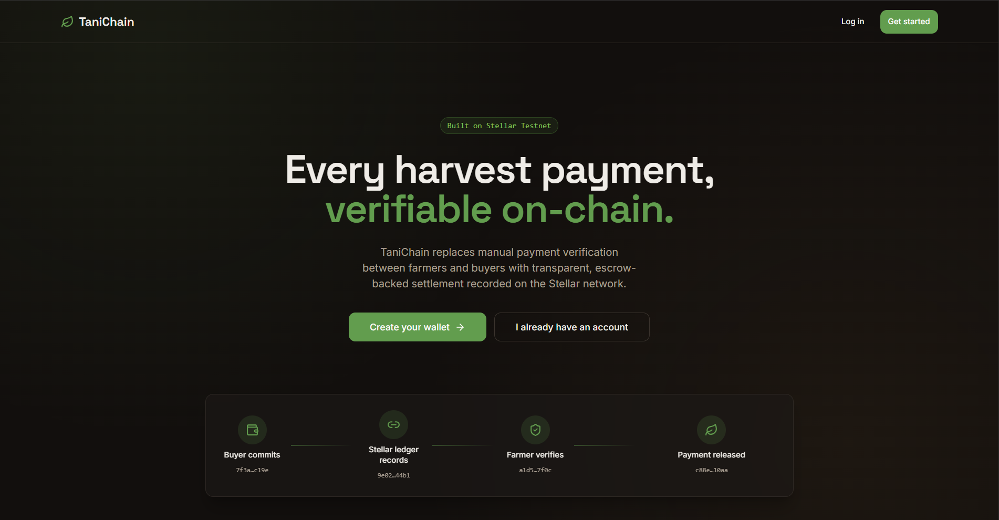
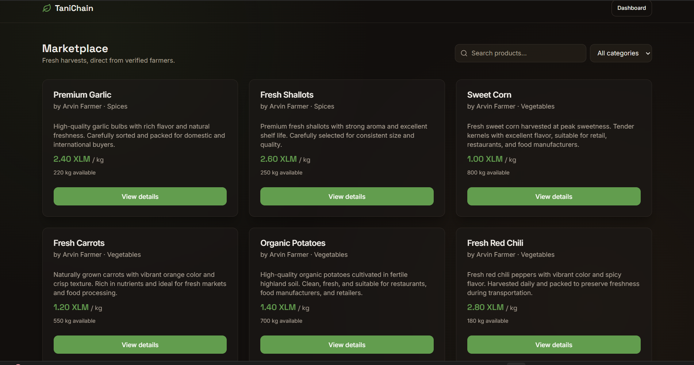
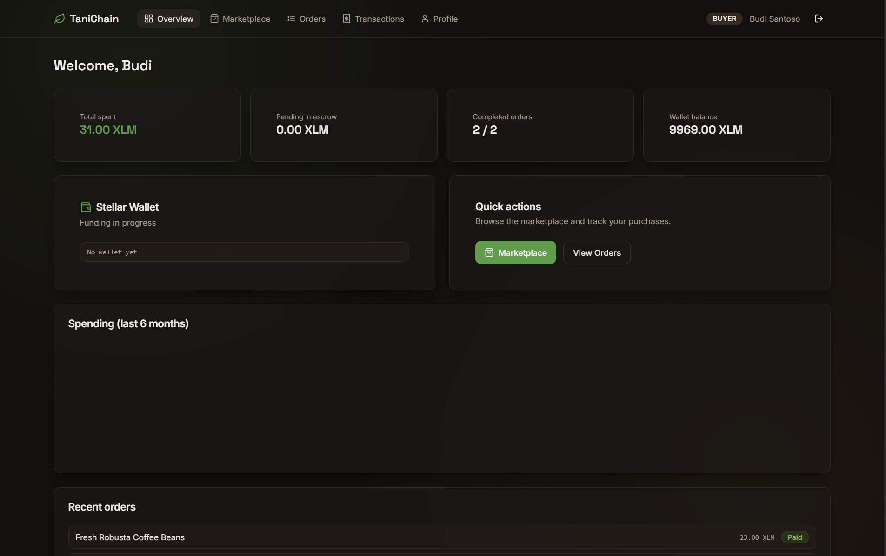
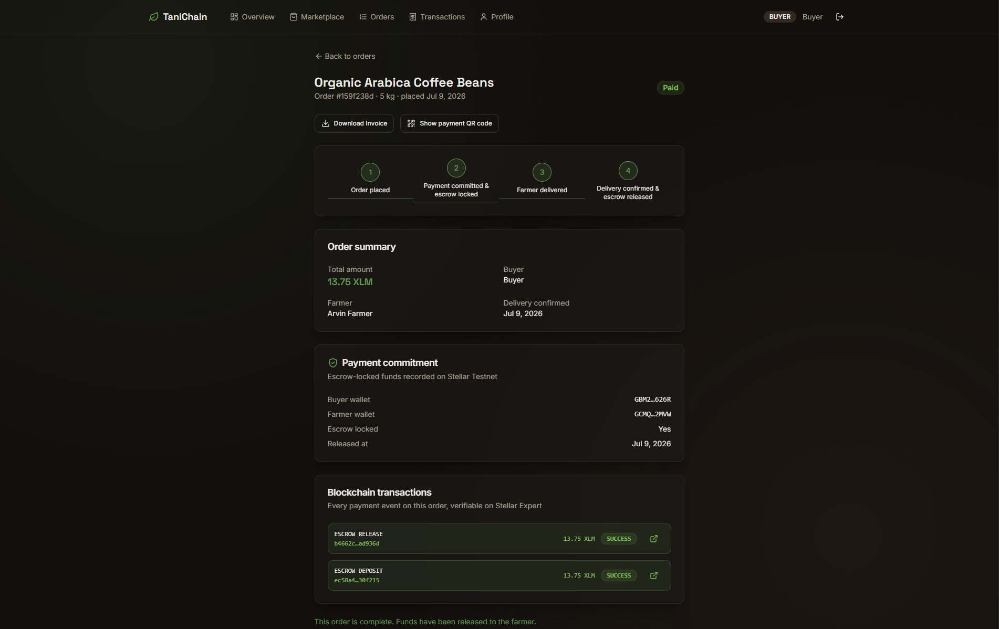
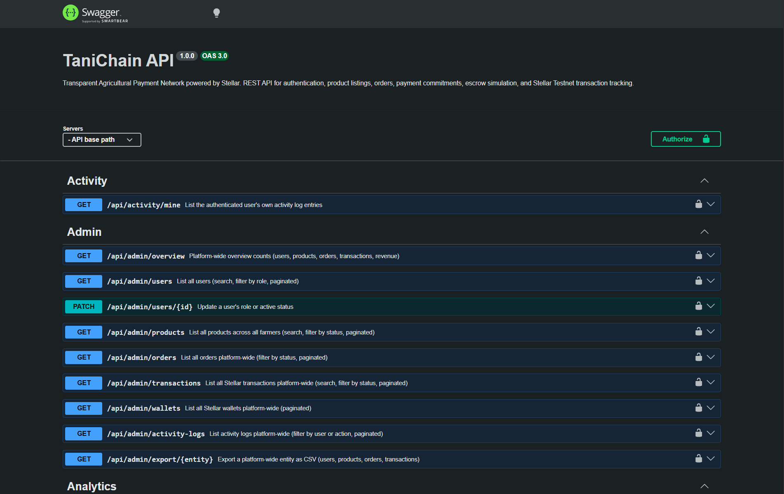
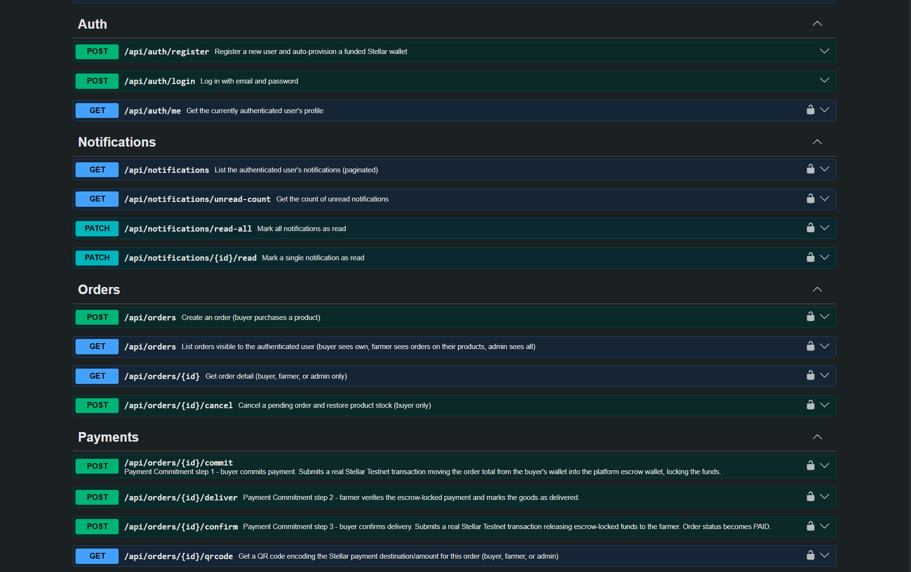
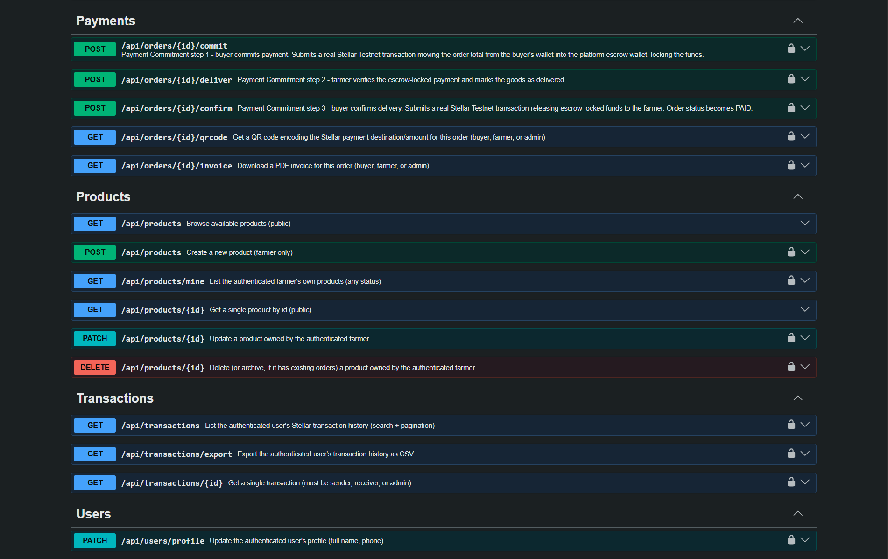
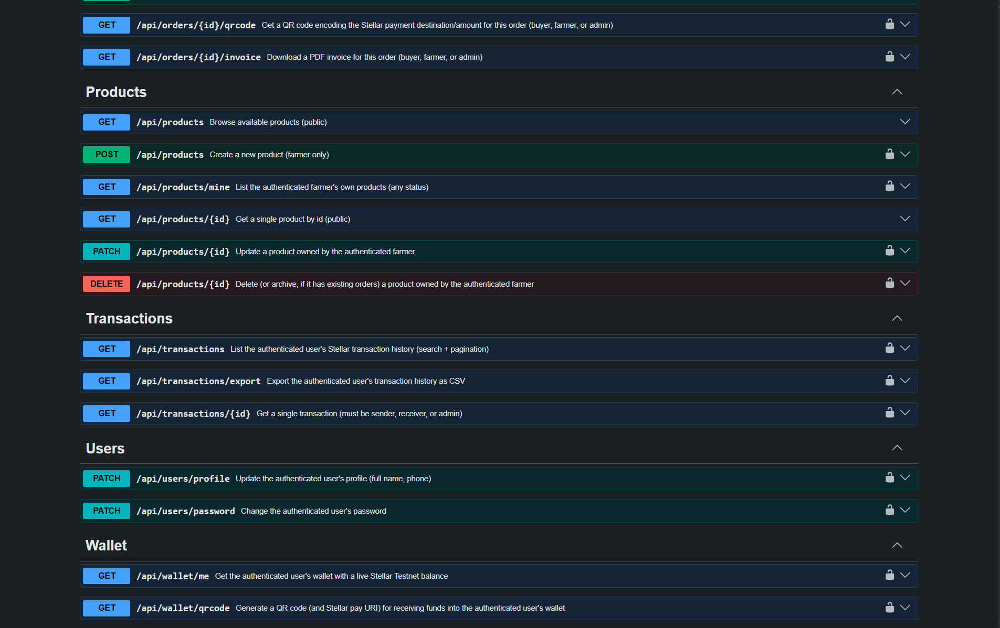

# 🌾 TaniChain

<div align="center">


**Transparent Agricultural Payment Network powered by Stellar**

A production-ready agricultural payment platform that enables transparent, escrow-backed, blockchain-verifiable transactions between farmers and buyers using the Stellar Testnet.

</div>

---

# 🌐 Live Demo

### Website

https://tanichain.arvinlabs.tech

### API Documentation

https://tanichain.arvinlabs.tech/api/docs

### GitHub Repository

https://github.com/ArvinFarrelP/tanichain

---

# 📖 Overview

TaniChain is a modern full-stack web platform that digitizes agricultural transactions by integrating traditional marketplace workflows with blockchain-backed payment verification.

Instead of relying on manual payment confirmation and opaque transaction records, TaniChain records payment commitments and settlement metadata on the Stellar Testnet, providing transparency, traceability, and trust for both farmers and buyers.

The platform combines a responsive Next.js frontend, an Express.js REST API, PostgreSQL database, Docker-based deployment, Nginx reverse proxy, HTTPS encryption via Let's Encrypt, and Cloudflare DNS/CDN for production-grade hosting.

---

# ✨ Key Features

- 🌱 Farmer product marketplace
- 💳 Escrow-inspired payment workflow
- ⛓️ Stellar Testnet transaction recording
- 🔐 JWT Authentication & Role-Based Access Control (RBAC)
- 👤 Buyer, Farmer, and Administrator roles
- 📦 Order management system
- 💼 Wallet management
- 📈 Analytics dashboard
- 📜 Activity logging
- 🔔 Notification system
- 📑 Interactive Swagger API Documentation
- 🐳 Dockerized deployment
- 🌍 HTTPS production deployment using Nginx + Let's Encrypt + Cloudflare

---

# 🛠 Tech Stack

## Frontend

- Next.js 15
- React
- TypeScript
- Tailwind CSS
- Axios

## Backend

- Express.js
- TypeScript
- Prisma ORM
- JWT Authentication
- Swagger OpenAPI
- Helmet
- Rate Limiter

## Database

- PostgreSQL 16

## Blockchain

- Stellar Testnet
- Horizon API

## Infrastructure

- Docker
- Docker Compose
- Nginx Reverse Proxy
- Let's Encrypt SSL
- Cloudflare DNS & CDN
- Ubuntu Server

---

# 📂 Project Structure

```text
tanichain/
├── backend/
│   ├── prisma/schema.prisma
│   ├── src/
│   │   ├── config/         # env, database client
│   │   ├── middleware/      # auth, validation, rate limiting, error handling
│   │   ├── modules/
│   │   │   ├── auth/        # register, login, profile
│   │   │   ├── user/        # profile update, change password
│   │   │   ├── wallet/      # Stellar keypair, Friendbot, wallet service, QR codes
│   │   │   ├── escrow/      # platform escrow wallet
│   │   │   ├── product/     # farmer CRUD, buyer browsing
│   │   │   ├── order/       # order lifecycle
│   │   │   ├── payment/     # Payment Commitment + Escrow workflow
│   │   │   ├── transaction/ # transaction history, CSV export
│   │   │   ├── invoice/     # PDF invoice generation
│   │   │   ├── export/      # CSV export helpers
│   │   │   ├── notification/
│   │   │   ├── analytics/   # role-aware + platform-wide analytics
│   │   │   ├── activity/    # audit log
│   │   │   └── admin/       # admin-only management endpoints
│   │   ├── utils/           # jwt, crypto, logger, AppError
│   │   └── swagger/
│   └── Dockerfile
├── frontend/
│   ├── src/
│   │   ├── app/
│   │   │   ├── (landing, /login, /register)
│   │   │   ├── products/, products/[id]/       # marketplace
│   │   │   └── dashboard/
│   │   │       ├── products/, orders/          # farmer/buyer workflows
│   │   │       ├── transactions/, profile/
│   │   │       └── admin/                      # overview, users, products, orders, transactions, wallets, activity
│   │   ├── components/ui/   # shadcn-style primitives
│   │   ├── components/layout/  # DashboardHeader, AdminNav
│   │   ├── components/products/ # ProductForm
│   │   ├── lib/             # api client, formatting, utils
│   │   └── store/           # zustand auth store
│   └── Dockerfile
├── docker/nginx/
├── docs/
├── docker-compose.yml
└── .env.example
```

---

# 🏗 System Architecture

```text
                              Users
                                │
                                │ HTTPS
                                ▼
                         Cloudflare CDN
                                │
                                ▼
                       Let's Encrypt SSL
                                │
                                ▼
                     Nginx Reverse Proxy
                      (HTTPS Termination)
                                │
                ┌───────────────┴───────────────┐
                │                               │
                ▼                               ▼
     Next.js Frontend                 Express Backend
   (React + TypeScript)             (REST API + Prisma)
                │                               │
                │         REST API              │
                └───────────────┬───────────────┘
                                │
                                ▼
                           PostgreSQL 16
                                │
                ┌───────────────┴───────────────┐
                │                               │
                ▼                               ▼
                  Stellar Horizon API      Swagger OpenAPI
                      (Blockchain)         Documentation

```

---

# 🌍 Production Deployment

```text
                           Internet
                              │
                              ▼
                        Cloudflare DNS
                              │
                              ▼
                  tanichain.arvinlabs.tech
                              │
                         HTTPS (TLS)
                              │
                              ▼
                    Ubuntu Server (AWS EC2)
                              │
                        Docker Compose
                              │
                              ▼
        ┌─────────────────────────────────────────────┐
        │                    Nginx                    │
        │                                             │
        │  /           → Frontend (Next.js)           │
        │  /api/*      → Backend (Express.js)         │
        │  /api/docs   → Swagger UI                   │
        └─────────────────────────────────────────────┘
                              │
                              ▼
                     PostgreSQL Database
```

---

# 🔄 Application Flow

```text
                         Buyer / Farmer
                               │
                               ▼
                      Frontend (Next.js)
                               │
                       REST API Request
                               │
                               ▼
                      Express.js Backend
                               │
                      JWT Authentication
                               │
                         Business Logic
                               │
                           Prisma ORM
                               │
                               ▼
                           PostgreSQL
                               │
                               ▼
                            Response
                               │
                               ▼
                     Frontend UI Update
```

---

# ⛓ Blockchain Payment Flow

```text
                             Buyer
                               │
                        Creates Order
                               │
                               ▼
                    Payment Commitment
                               │
                               ▼
                     Backend Validation
                               │
                               ▼
                 Record Metadata to
                    Stellar Testnet
                               │
                               ▼
               Transaction Hash Stored
                      in Database
                               │
                               ▼
                   Farmer Verification
                               │
                               ▼
                     Payment Released
```

---

# 🐳 Docker Architecture

```text
Docker Compose

├── nginx
│      │
│      ├── HTTPS Reverse Proxy
│      ├── SSL Termination
│      └── Route Requests
│
├── frontend
│      │
│      └── Next.js Production Server
│
├── backend
│      │
│      ├── Express API
│      ├── Prisma ORM
│      └── Swagger Docs
│
└── postgres
       │
       └── Persistent Database
```

---

# 🔐 Security Features

TaniChain is designed with security-first principles and includes multiple layers of protection.

### Authentication

- JWT Authentication
- Secure password hashing
- Role-Based Access Control (RBAC)
- Protected API endpoints

### API Security

- Helmet Security Headers
- Rate Limiting
- Input Validation
- Centralized Error Handling
- CORS Protection

### Infrastructure Security

- HTTPS via Let's Encrypt
- Cloudflare DNS & CDN
- Nginx Reverse Proxy
- Secure Docker Network
- Environment Variable Management

---

# 🚀 Getting Started

## Prerequisites

Before running TaniChain, make sure the following software is installed:

- Docker
- Docker Compose
- Git
- Node.js 20+ (optional for local development)
- PostgreSQL 16 (optional for local development)

---

# 📥 Clone Repository

```bash
git clone https://github.com/ArvinFarrelP/tanichain.git

cd tanichain
```

---

# ⚙ Environment Variables

Copy the example environment file.

```bash
cp .env.example .env
```

Edit the configuration as needed.

Example:

```env
POSTGRES_USER=tanichain
POSTGRES_PASSWORD=your_password
POSTGRES_DB=tanichain

JWT_SECRET=your_super_secret

WALLET_ENCRYPTION_KEY=your_encryption_key

STELLAR_NETWORK=TESTNET
STELLAR_HORIZON_URL=https://horizon-testnet.stellar.org
STELLAR_FRIENDBOT_URL=https://friendbot.stellar.org

CORS_ORIGIN=https://tanichain.arvinlabs.tech

NEXT_PUBLIC_API_URL=https://tanichain.arvinlabs.tech/api
```

---

# 🐳 Docker Deployment (Recommended)

Build every container.

```bash
docker compose build
```

Run all services.

```bash
docker compose up -d
```

Check running containers.

```bash
docker ps
```

Expected containers:

```
tanichain-nginx
tanichain-frontend
tanichain-backend
tanichain-postgres
```

---

# 📊 Check Container Health

```bash
docker ps
```

Expected output:

```
STATUS

healthy
healthy
healthy
healthy
```

---

# 🧪 Health Check API

Backend Health Endpoint

```bash
curl http://localhost:4000/health
```

Response

```json
{
  "success": true,
  "message": "TaniChain API is healthy"
}
```

---

# 🌐 Production Deployment

TaniChain is deployed using Docker Compose on Ubuntu Server with Nginx Reverse Proxy and HTTPS.

### Production URLs

Website

```
https://tanichain.arvinlabs.tech
```

Swagger Documentation

```
https://tanichain.arvinlabs.tech/api/docs
```

API Endpoint

```
https://tanichain.arvinlabs.tech/api
```

---

# 🔒 HTTPS Configuration

Production deployment includes:

- Let's Encrypt SSL Certificate
- Automatic HTTP → HTTPS Redirect
- TLS 1.2 / TLS 1.3
- Nginx Reverse Proxy
- Cloudflare DNS
- Dockerized Infrastructure

---

# 💻 Local Development

## Backend

```bash
cd backend

npm install

npx prisma generate

npx prisma migrate dev

npm run dev
```

Backend runs on

```
http://localhost:4000
```

---

## Frontend

```bash
cd frontend

npm install

npm run dev
```

Frontend runs on

```
http://localhost:3000
```

---

# 📖 API Documentation

Swagger UI

Production

```
https://tanichain.arvinlabs.tech/api/docs
```

Development

```
http://localhost:4000/api/docs
```

OpenAPI JSON

```
http://localhost:4000/api/docs.json
```

---

# 🛠 Useful Docker Commands

Build images

```bash
docker compose build
```

Start containers

```bash
docker compose up -d
```

Stop containers

```bash
docker compose down
```

Restart

```bash
docker compose restart
```

View logs

```bash
docker compose logs -f
```

Check running containers

```bash
docker ps
```

Open backend shell

```bash
docker compose exec backend sh
```

Open PostgreSQL

```bash
docker compose exec postgres psql -U tanichain
```

---

# 🌱 Demo Data

Generate demo accounts and sample data.

```bash
docker compose exec backend npm run seed
```

This command automatically creates:

- Farmers
- Buyers
- Administrator
- Products
- Orders
- Transactions
- Stellar Wallets
- Payment Commitments

making the application ready for demonstrations without manual setup.

---

# 🚀 Features

## 👥 Multi-Role Authentication

TaniChain supports Role-Based Access Control (RBAC) with four different user roles.

| Role             | Permissions                                                |
| ---------------- | ---------------------------------------------------------- |
| 👨‍🌾 Farmer        | Manage products, receive orders, track payments            |
| 🛒 Buyer         | Browse marketplace, purchase products, view transactions   |
| 🏢 Cooperative   | Manage cooperative-related activities _(future expansion)_ |
| 👑 Administrator | Full platform management and analytics                     |

Authentication features include:

- JWT Authentication
- Password Hashing (bcrypt)
- Protected Routes
- Role-Based Authorization (RBAC)
- Secure Session Management

---

# 🌱 Marketplace

Farmers can publish agricultural products while buyers can browse available commodities in real time.

### Farmer Features

- Create Products
- Update Products
- Archive Products
- Inventory Management
- Product Categories
- Stock Management

### Buyer Features

- Browse Marketplace
- Product Detail
- Search Products
- Category Filtering
- Pagination
- Purchase Products

---

# 💳 Payment Commitment Workflow

Instead of relying on traditional payment confirmation, TaniChain introduces a transparent payment commitment process backed by Stellar Testnet transactions.

Workflow:

```text
Buyer
   │
Create Order
   │
   ▼
Payment Commitment
   │
   ▼
Blockchain Record
   │
   ▼
Farmer Confirmation
   │
   ▼
Payment Released
```

This provides:

- Transparent payments
- Immutable transaction records
- Verifiable blockchain history
- Escrow-inspired settlement workflow

---

# ⛓️ Blockchain Integration

TaniChain integrates with the **Stellar Testnet** to provide secure and transparent payment verification.

Features include:

- Automatic Wallet Creation
- Friendbot Funding
- Stellar SDK Integration
- Horizon API
- Transaction Explorer Links
- Blockchain Transaction History
- Wallet Balance Tracking

Every registered user automatically receives:

- Stellar Wallet
- Public Key
- Encrypted Secret Key
- Initial Testnet Balance

---

# 💼 Wallet Management

Each user owns a blockchain wallet.

Features include:

- Wallet Address
- Current Balance
- QR Code Generation
- Transaction History
- Payment QR
- Blockchain Explorer Link

---

# 📦 Order Management

Complete order lifecycle management.

Supported order states include:

- Pending
- Payment Committed
- Paid
- Processing
- Delivered
- Completed
- Cancelled

Users can:

- View Orders
- Track Status
- Search Orders
- Filter Orders
- Download Invoice

---

# 📑 PDF Invoice

Every completed order can generate a professional invoice.

Invoice includes:

- Buyer Information
- Farmer Information
- Product Details
- Quantity
- Total Price
- Payment Status
- Blockchain Transaction Hash
- Order Date

---

# 📤 CSV Export

Users can export data into CSV format.

Supported exports:

- Transactions
- Products
- Orders

Administrator exports:

- Users
- Products
- Orders
- Transactions

---

# 📊 Analytics Dashboard

Interactive dashboards provide valuable insights into platform activities.

Dashboard Features

- Revenue Summary
- Monthly Revenue
- Wallet Balance
- Pending Orders
- Completed Orders
- Transaction Statistics
- Charts & Graphs

Built using:

- Recharts
- React
- TypeScript

---

# 👑 Administrator Dashboard

Administrators have complete visibility over the platform.

Features include:

- User Management
- Product Management
- Order Management
- Transaction Management
- Wallet Monitoring
- Activity Logs
- Platform Analytics

---

# 🔔 Notification System

Real-time notifications are generated for important events.

Notifications include:

- New Order
- Payment Committed
- Payment Released
- Delivery Confirmation
- Transaction Updates

---

# 📜 Activity Logs

Every important action is recorded.

Examples:

- User Login
- Registration
- Product Creation
- Product Update
- Order Creation
- Payment Commitment
- Transaction Completion

Administrators can monitor all platform activities.

---

# 🔐 Security

TaniChain follows modern web security best practices.

Authentication

- JWT Authentication
- bcrypt Password Hashing
- Role-Based Access Control

API Protection

- Helmet
- Rate Limiting
- Input Validation
- Error Handling

Infrastructure

- HTTPS (Let's Encrypt)
- Cloudflare CDN
- Docker Network Isolation
- Reverse Proxy (Nginx)

---

# ⭐ Project Highlights

✔ Production-ready deployment

✔ Dockerized infrastructure

✔ HTTPS with Let's Encrypt

✔ Cloudflare integration

✔ Custom domain

✔ Swagger OpenAPI Documentation

✔ Blockchain-powered payment verification

✔ Responsive web application

✔ RESTful API architecture

✔ PostgreSQL database

✔ Docker Compose deployment

✔ Nginx Reverse Proxy

✔ Role-Based Access Control (RBAC)

✔ Interactive analytics dashboard

✔ Stellar Testnet integration

✔ Modern UI built with Next.js 15

✔ TypeScript across frontend and backend

---

# 📸 Screenshots

> Below are screenshots of the current TaniChain application.

## 🌐 Landing Page



---

## 🛒 Marketplace



---

## 📊 User Dashboard



---

## 💰 Payment Commitment



---

## 📖 Swagger API Documentation



<br>



<br>



<br>



---

# 📚 API Overview

| Module         | Description                    |
| -------------- | ------------------------------ |
| Authentication | User registration & login      |
| Products       | Marketplace product management |
| Orders         | Buyer & farmer order workflow  |
| Transactions   | Payment history                |
| Wallet         | Stellar wallet management      |
| Analytics      | Dashboard statistics           |
| Notifications  | User notifications             |
| Activity       | Audit logs                     |
| Administration | Platform management            |

---

# 📂 Documentation

Additional project documentation is available inside the **docs/** directory.

| Document      | Description                 |
| ------------- | --------------------------- |
| API.md        | REST API Reference          |
| DEPLOYMENT.md | Production Deployment Guide |
| SECURITY.md   | Security Review             |
| PROGRESS.md   | Development Progress        |

---

# 🧪 Testing

Backend

```bash
npm test
```

Run Docker Stack

```bash
docker compose up --build
```

Generate Demo Data

```bash
docker compose exec backend npm run seed
```

Health Check

```bash
curl https://tanichain.arvinlabs.tech/api/health
```

---

# 🛣️ Roadmap

Future improvements planned for TaniChain.

## Blockchain

- Smart Contract Support
- Multi-Signature Wallet
- Soroban Integration
- Stellar Mainnet Deployment

---

## Marketplace

- Product Images
- Product Reviews
- Wishlist
- Shopping Cart
- Farmer Verification Badge

---

## Payments

- QR Payment
- Automatic Escrow
- Partial Payments
- Payment History Export

---

## Infrastructure

- CI/CD Pipeline
- Kubernetes Deployment
- Redis Cache
- Prometheus Monitoring
- Grafana Dashboard

---

## Mobile

- Android Application
- iOS Application
- Push Notifications

---

# 🤝 Contributing

Contributions are welcome!

1. Fork this repository

2. Create a new branch

```bash
git checkout -b feature/my-feature
```

3. Commit your changes

```bash
git commit -m "feat: add amazing feature"
```

4. Push your branch

```bash
git push origin feature/my-feature
```

5. Open a Pull Request

---

# 📄 License

This project is released under the **MIT License**.

See the LICENSE file for more information.

---

# 🙏 Acknowledgements

This project would not have been possible without these amazing technologies and communities.

- Stellar Development Foundation
- Stellar SDK
- Horizon API
- Next.js
- Express.js
- PostgreSQL
- Prisma ORM
- Docker
- Nginx
- Tailwind CSS
- TypeScript
- Swagger OpenAPI
- Cloudflare
- Let's Encrypt

---

# 🏆 Hackathon Information

**Project**

TaniChain

**Event**

APAC Stellar Hackathon 2026

**Track**

Real-World Payments & Financial Inclusion

**Core Idea**

A transparent agricultural payment platform leveraging the Stellar blockchain to provide secure, verifiable, and auditable payment commitments for farmers and buyers.

---

# 👨‍💻 Author

**Arvin Farrel Pramuditya**

Backend Engineer • Blockchain Developer • AI Developer

GitHub

https://github.com/ArvinFarrelP

LinkedIn

https://linkedin.com/in/ArvinFarrelP

---

<div align="center">

### 🌾 TaniChain

**Transparent Agricultural Payment Network powered by Stellar**

Built with ❤️ using

Next.js • Express.js • PostgreSQL • Docker • Nginx • Stellar Testnet

⭐ If you found this project interesting, consider giving it a star!

</div>
